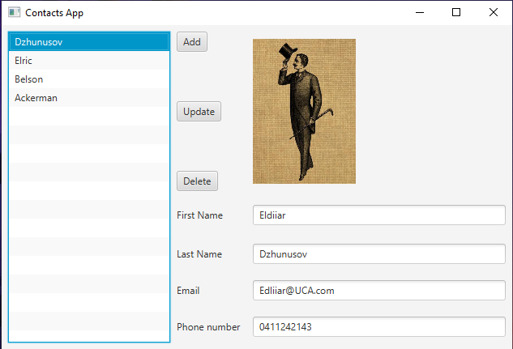
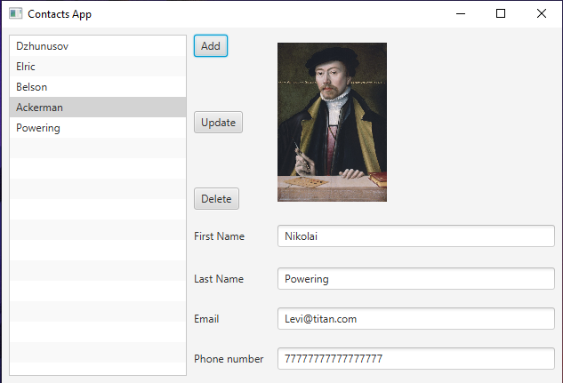
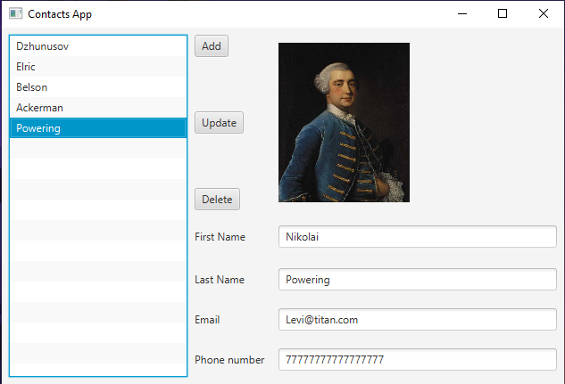
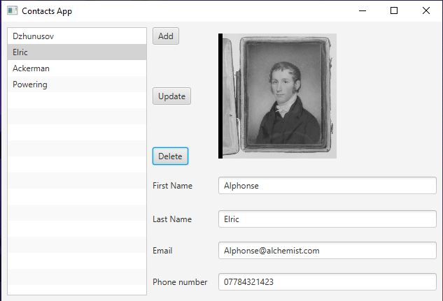

# Contacts App Modification
Made by Eldiiar Dzhunusov

Advanced Contacts App with the profile pictures

## Download the JavaFX SDK:
#### https://gluonhq.com/products/javafx/

## Add JavaFX library:

#### File -> Project Structure -> Libraries -> add library 
#### path->C:\javafx-sdk-11.0.2\lib (will depend)

## Add VM Options:
#### Run-> Edit Configuration -> modify options -> add vm options
#### --module-path %PATH_TO_JAVAFX_SDK/LIB% --add-modules javafx.controls,javafx.fxml 

## Screenshots

---

---

---

