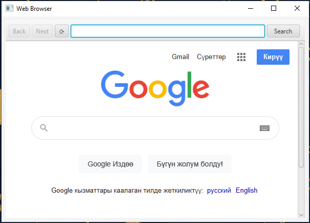
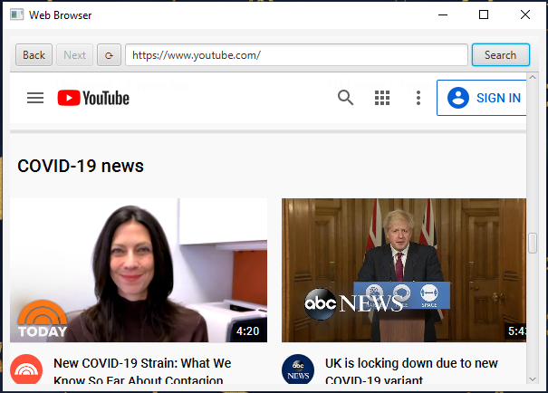
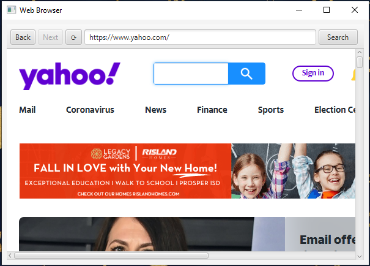

# Mini Browser
Made by Eldiiar Dzhunusov

Mini browser app with the possibility to enter websites by their addresses. Back, next , and refresh buttons are implemented.

## Download the JavaFX SDK:
#### https://gluonhq.com/products/javafx/

## Add JavaFX library:

#### File -> Project Structure -> Libraries -> add library 
#### path->C:\javafx-sdk-11.0.2\lib (will depend)

## Add VM Options:
#### Run-> Edit Configuration -> modify options -> add vm options
#### --module-path  %PATH_TO_JAVAFX_SDK/LIB% --add-modules=javafx.swing,javafx.graphics,javafx.fxml,javafx.media,javafx.web --add-reads javafx.graphics=ALL-UNNAMED --add-opens javafx.controls/com.sun.javafx.charts=ALL-UNNAMED --add-opens javafx.graphics/com.sun.javafx.iio=ALL-UNNAMED --add-opens javafx.graphics/com.sun.javafx.iio.common=ALL-UNNAMED --add-opens javafx.graphics/com.sun.javafx.css=ALL-UNNAMED --add-opens javafx.base/com.sun.javafx.runtime=ALL-UNNAMED

## Screenshots

---

---

